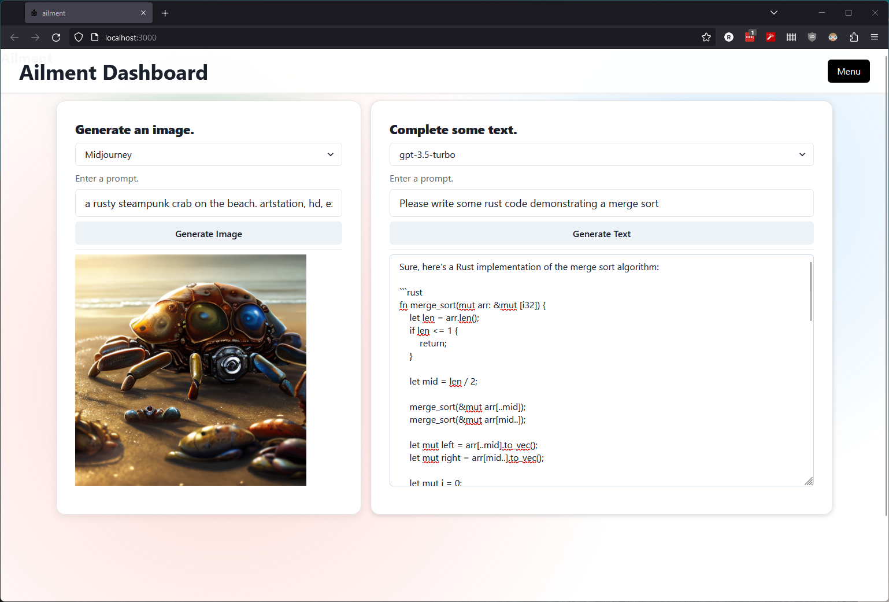

# ailment

> pronounced "ay - eye - lament"

A dashboard for aaalllll the AI API's.

Requires API creds in environment variables.

Available now:
- DALL-E
- ChatGPT
- Midjourney
- Stable Diffusion
- Moises (stem separation)

Coming soon:
- Whisper
- Something that generates a prompt for an image



## Getting started

1. Install dependencies

    ```sh
    poetry install
    ```

1. Add your API credentials to envvars for the services you want to use (see [`./example.env`](./example.env)).

    ```sh
    export REPLICATE_API_TOKEN="your-api-key"
    ```

1. Run it!

    ```sh
    poetry run pc run
    ```
